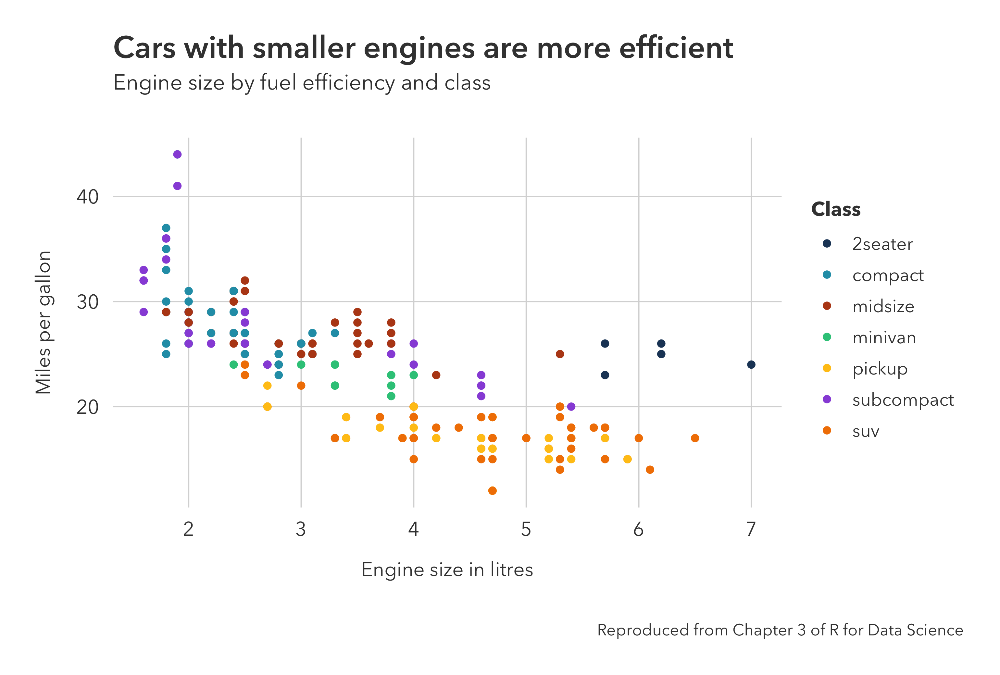
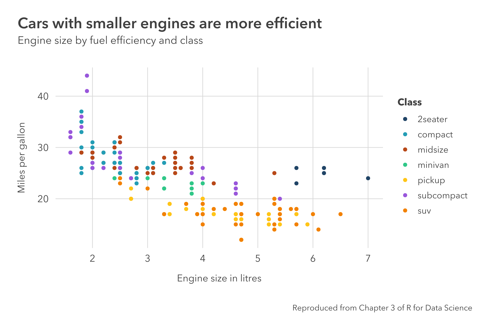
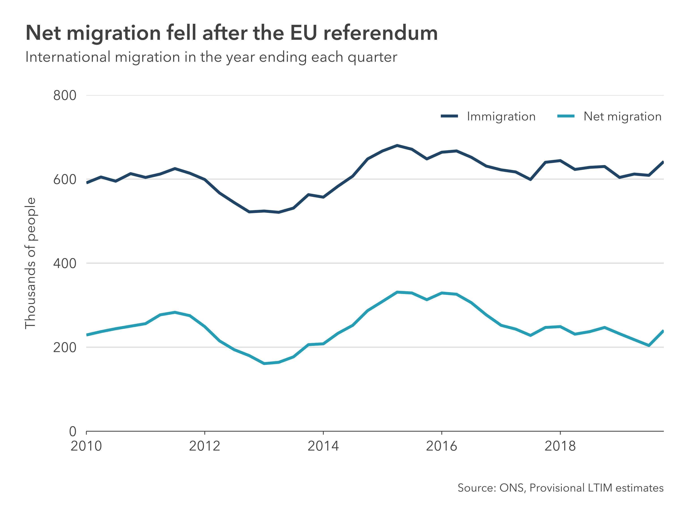
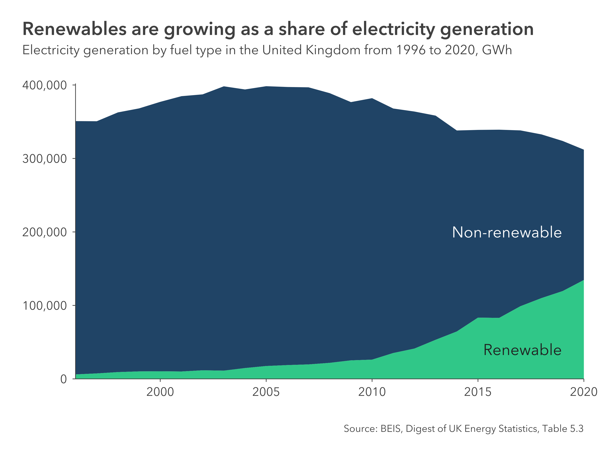
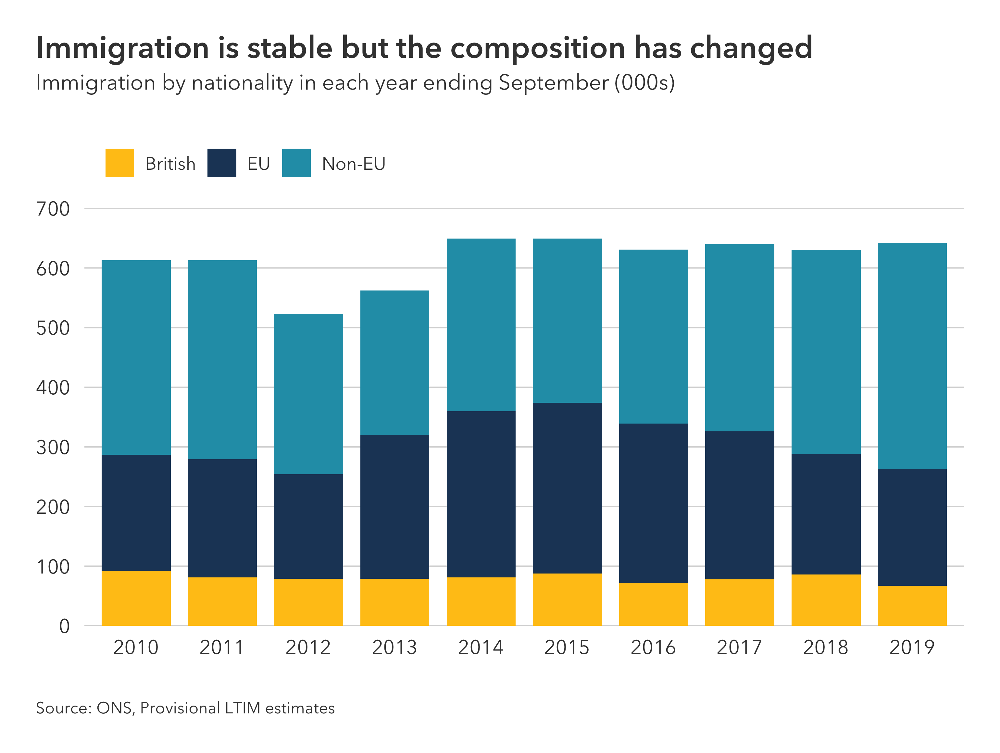
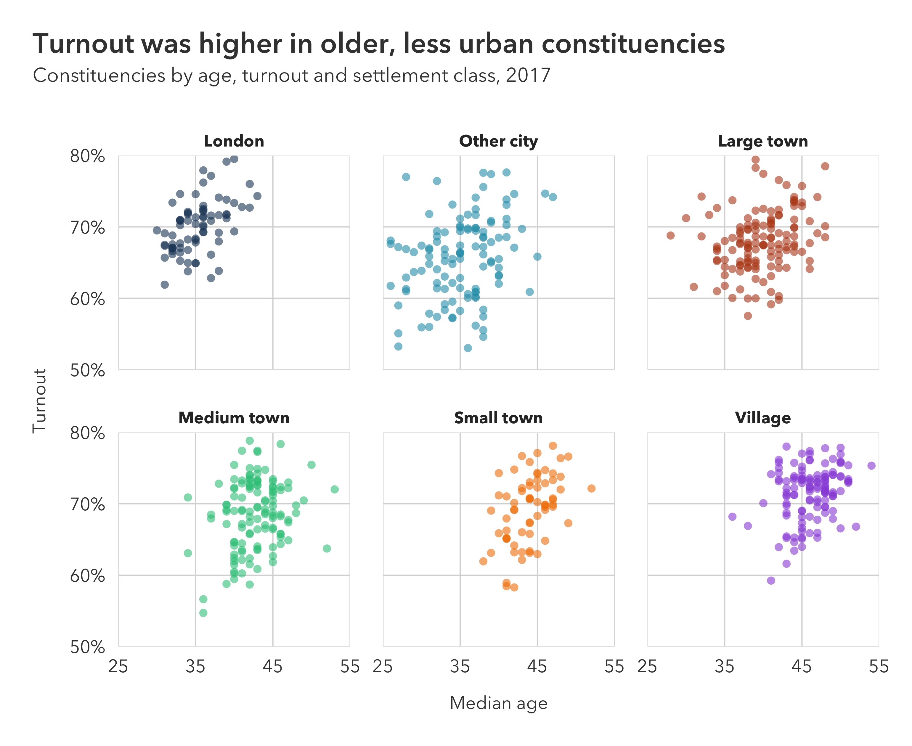
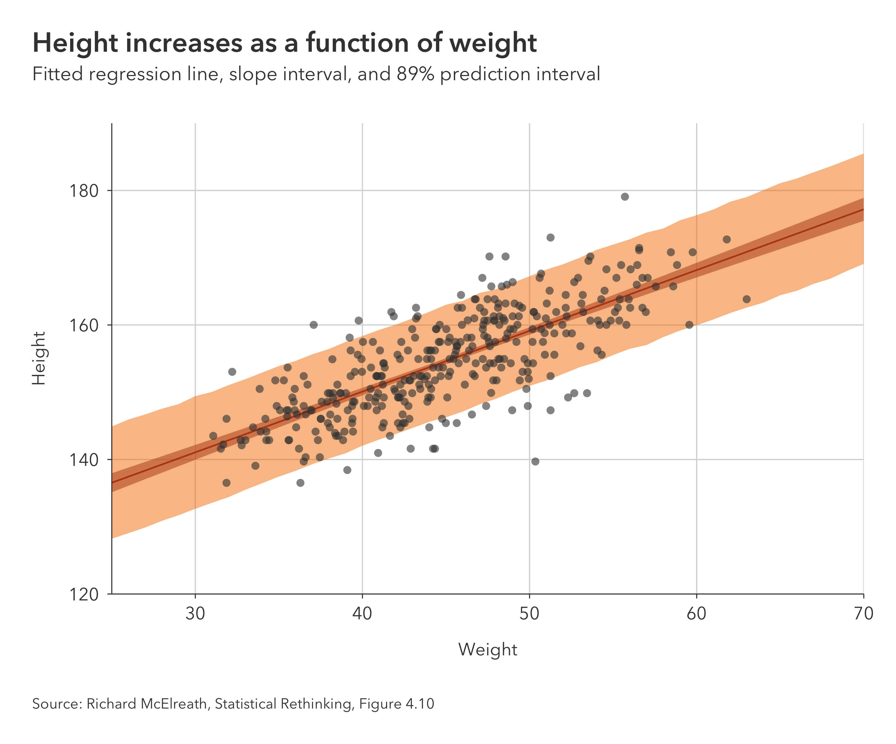

# pilot

Pilot is an attractive, minimal, general purpose ggplot2 theme with an accessible discrete color palette.


## Installation

Install from GitHub using remotes.

``` r
install.packages("remotes")
remotes::install_github("olihawkins/pilot")
```

## Basic usage

Import the package and add `theme_pilot` to a plot made with `ggplot` in the normal way.

```r
library(ggplot2)
library(pilot)

plot <- ggplot(
        data = mpg,
        mapping = aes(
            x = displ, 
            y = hwy, 
            color = class)) + 
    geom_point() +
    labs(
        title = "Cars with smaller engines are more efficient",
        subtitle = "Engine size by fuel efficiency and class",
        x = "Engine size in litres",
        y = "Miles per gallon",
        color = "Class",
        caption = "Reproduced from Chapter 3 of R for Data Science") + 
    theme_pilot() +
    scale_color_pilot()
```



By default, ggplot2 horizontally aligns the title and subtitle with the left-hand edge of the plotting area. A helper function called `add_pilot_titles` is available that will align the title and subtitle with the left-hand edge of the whole plot instead. To use it, first create the plot in the normal way, but without specifying the title and subtitle, and then use `add_pilot_titles` to add the titles to the plot. 

```r
library(ggplot2)
library(pilot)

plot <- ggplot(
        data = mpg,
        mapping = aes(
            x = displ, 
            y = hwy, 
            color = class)) + 
    geom_point() +
    labs(
        x = "Engine size in litres",
        y = "Miles per gallon",
        color = "Class",
        caption = "Reproduced from Chapter 3 of R for Data Science") + 
    theme_pilot() +
    scale_color_pilot()

plot <- add_pilot_titles(
    plot,
    title = "Cars with smaller engines are more efficient",
    subtitle = "Engine size by fuel efficiency and class")
```



Note that `add_pilot_titles` uses `patchwork` behind the scenes to compose a new plot from the existing plot and the titles. So if you want to adjust the plot margins using a `theme` customisation, do it *after* you have applied the titles, otherwise your customisation will be overwritten by `add_pilot_titles`.

## Colors

The package includes an accessible discrete color palette, comprising seven colors that aim to be visually distinct to people with the most common forms of color blindness. You can see what the colors look like under different conditions of color blindness using the [Viz Palette](https://projects.susielu.com/viz-palette?colors=[%22#204466%22,%22#b84818%22,%22#9956db%22,%22#249db5%22,%22#f28100%22,%22#30c788%22,%22#ffc517%22]) tool. 

These colors are available in a named vector called `pilot_colors`. The base color names are:

* __navy__
* __blue__
* __brown__
* __green__
* __yellow__
* __purple__
* __orange__

You can use the `pilot_color` function to return the unnamed hex code value for a given name. This makes it easy to map specific colors to categorical variables using the `scale_color_manual()` and `scale_fill_manual()` functions.

```r
scale_color_manual(values = c(
    "a" = pilot_color("navy"),
    "b" = pilot_color("blue")))
```

These colors are also avaialable as ggplot2 scales with a range of palettes representing different subsets of the colors. See `scale_color_pilot` and `scale_fill_pilot` for further details in the function reference below. 

However, care should be taken in how you use these scales. For convenience, these scales support ggplot2's color interpolation feature. But expanding the seven color palette to represent more than seven categories risks creating new colors that are no longer visually distinct to people with color blindness. To ensure the colors remain distinct, you should only use these scales with discrete data that has the same number of categories as the palette that you choose.

## Fonts

The theme uses a different default font on each desktop opertating system. These are "Avenir Next" on MacOS, "Trebuchet MS" on Windows, and the default sans-serif font on Linux. 

You can customise the fonts the theme uses in three ways: 

- Universally -- By setting family options for the theme in .Rprofile
- Per R session -- By setting the options dynamically using `options` or `set_pilot_family`
- Per plot -- By using the family arguments in `theme_pilot`

The full list of font family options that can be set in .Rprofile or using `options` are:

- `pilot.title_family`
- `pilot.subtitle_family`
- `pilot.axis_title_family`
- `pilot.axis_text_family`
- `pilot.legend_title_family`
- `pilot.legend_text_family`
- `pilot.facet_title_family`
- `pilot.caption_family`
- `pilot.geom_text_family`
- `pilot.annotate_family`

The `set_pilot_family` function sets all the font family options to the same family with a single function call.

```r
set_pilot_family("Helvetica Neue")
```

You can optionally set a different family for the main title.

```r
set_pilot_family("Avenir Next", title_family = "Avenir Next Demi Bold")
```

Use `?theme_pilot` to see the documentation showing the full list of arguments that can be used to customise the fonts for an individual plot using the arguments in `theme_pilot`.

## Function reference

### Themes

Apply the theme to a plot with `theme_pilot()`. There are a large number of arguments you can use to configure the components of the theme. Use `?theme_pilot` to see the full list of arguments. The principal arguments are documented below.

---

_pilot_::__theme_pilot__(_axes = ""_, _grid = "hv"_, _legend_position = "right"_, _caption_position = "right"_, _..._)

Set the theme with the following arguments:

* __axes__ A string indicating which axes should have lines and ticks. Specify which axes to show by including the matching characters in the string: "t" for top, "r" for right, "b" for bottom, "l" for left. You will need to ensure this argument is consistent with the axes settings in your plot for the lines and ticks to be displayed. The default is an empty string, meaning no ticks and lines are shown on any axes by default.
* __grid__ A string indicating which gridlines should be shown. Specify the gridlines to show by including the matching characters in the string: "h" for horizontal, "v" for vertical. The default is "hv", meaning both gridlines are shown by default.
* __legend_position__ A string indicating the position of the legend. Valid positions are "top", "right", "bottom", "left", "top-right", "top-left", "bottom-right", "bottom-left", and "none". The default is "right".
* __caption_position__ A string indicating the horizontal position of the caption. Valid positions are "left" or "right". The default is "right".

---

### Scales

Use `scale_color_pilot()` or `scale_fill_pilot()` as approriate. Both functions have the same signature. Please see the note on colors above for appropiate use of these scales.

---

_pilot_::__scale_color_pilot__(_palette = "seven"_, _discrete = TRUE_, _reverse = FALSE_, _..._)
_pilot_::__scale_fill_pilot__(_palette = "seven"_, _discrete = TRUE_, _reverse = FALSE_, _..._)

Sets the scales with the following arguments. The default palette is "seven".

* __palette__ The name of a palette. Valid names are:
    * _two_ - navy, blue
    * _three_ - navy, blue, brown
    * _four_ - navy, blue, brown, green
    * _five_ - navy, blue, brown, green, yellow
    * _six_ - navy, blue, brown, green, yellow, purple
    * _seven_ - navy, blue, brown, green, yellow, purple, orange
* __discrete__ Boolean to indicate if color aesthetic is discrete.
* __reverse__ Boolean to indicate whether palette should be reversed.
* __...__ Additional arguments passed to `discrete_scale` or `scale_color_gradient`, depending on the value of `discrete`.

---

## Gallery

The following gallery shows examples of how to create different types of charts with `pilot`. The datasets for each of these can be found in the [gallery/examples](gallery/examples) folder.

### Bar chart


```r
# Imports ---------------------------------------------------------------------

library(tidyverse)
library(pilot)

# Read in and prepare the data ------------------------------------------------

# Load the data from the csv as a dataframe
df <- read_csv("bar-chart-labels.csv")

# Turn the region column into a factor and order it by the population in each
# region: this sorts the bars in the chart from largest to smallest
df$region <- factor(df$region)
df$region <- fct_reorder(df$region, df$population, max)

# Create the plot -------------------------------------------------------------

# Use ggplot to create a plot with data
plot <- ggplot(data = df) +
    # Add a column geometry for the bars
    geom_col(
        mapping = aes(
            x = population,
            y = region),
        fill = pilot_color("navy")) +
    # Add a text geometry for the labels: geom_text_pilot uses the theme fonts
    geom_text_pilot(
        mapping = aes(
            x = population,
            y = region,
            label = format(population, digits = 2)),
        hjust = "center",
        nudge_x = -0.4) +
    # Set labels for the axes, but don't set titles here
    labs(
        x = "Millions of people",
        y = NULL) +
    # Configure the the x and y axes, removing the expansion for the x axis
    scale_x_continuous(
        limits = c(0, 10),
        breaks = seq(0, 10, 2),
        expand = c(0,0)) +
    scale_y_discrete(
        expand = expansion(add = c(0.6, 0.6))) +
    # Add the Pilot theme, setting a bottom axis with no gridlines
    theme_pilot(
        axes = "b",
        grid = "")

# After creating the plot, add a title and subtitle with add_pilot_titles
plot <- add_pilot_titles(
    plot,
    title = "Countries and regions vary in population",
    subtitle = "Population of countries and regions in mid-2020, United Kingdom")

# Save the plot in different formats ------------------------------------------

# Save a high resolution export of the plot as a png
save_png(
    "bar-chart-labels.png",
    plot = plot,
    width = 7.7,
    height = 6.2)

# Save an editable verson of the plot as an svg
save_svg(
    "bar-chart-labels.svg",
    plot = plot,
    width = 7.7,
    height = 6.2)
```

### Line chart



```r
# Imports ---------------------------------------------------------------------

library(tidyverse)
library(pilot)

# Read in and prepare the data ------------------------------------------------

# Load the data from the csv as a dataframe
df <- read_csv("line-chart.csv")

# Create the plot -------------------------------------------------------------

# Use ggplot to create a plot with data and mappings
plot <- ggplot(
        data = df,
        mapping = aes(
            x = quarter,
            y = estimate,
            color = flow)) +
    # Add a line geometry to draw lines
    geom_line(size = 1.1) +
    # Set labels for the axes, legend, and caption, but don't set titles here
    labs(
        color = NULL,
        x = NULL,
        y = "Thousands of people",
        caption = "Source: ONS, Provisional LTIM estimates") +
    # Configure the the x and y axes: we set the y axis breaks and limits
    scale_x_date(
        expand = c(0, 0)) +
    scale_y_continuous(
        breaks = seq(0, 800, 200),
        limits = c(0, 800),
        expand = c(0, 0)) +
    # Add the Pilot theme, setting a bottom axis and horizontal gridlines
    theme_pilot(
        axes = "b",
        grid = "h") +
    # Use scale_color_manual and pilot_color to set colors for each lines
    scale_color_manual(values = c(
        "Immigration" = pilot_color("navy"),
        "Net migration" = pilot_color("blue"))) +
    # Here we use a theme customisation to overlay the legend on the plot area:
    # We could have used legend_position = "top-right" in theme_pilot
    # to put the legend at the top-right above the plot area
    theme(
        legend.position = c(1.03, 0.99),
        legend.justification = c(1, 1),
        legend.direction = "horizontal",
        legend.text = element_text(margin = margin(r = 10)))

# After creating the plot, add a title and subtitle with add_pilot_titles
plot <- add_pilot_titles(
    plot,
    title = "Net migration fell after the EU referendum",
    subtitle = "International migration in the year ending each quarter")

# Save the plot in different formats ------------------------------------------

# Save a high resolution export of the plot as a png
save_png(
    "line-chart.png",
    plot = plot,
    width = 7.7,
    height = 5.8)

# Save an editable verson of the plot as an svg
save_svg(
    "line-chart.svg",
    plot = plot,
    width = 7.7,
    height = 5.8)
```

### Area chart



```r
# Imports ---------------------------------------------------------------------

library(tidyverse)
library(scales)
library(pilot)

# Read in and prepare the data ------------------------------------------------

# Load the data from the csv as a dataframe and pivot it into a tidy format
df <- read_csv("area-chart-annotations.csv") %>%
    pivot_longer(
        cols = -date,
        names_to = "energy_source",
        values_to = "gwh")

# Turn the energy_source column into a factor: setting the order of the levels
# controls the order of the categories from top to bottom
df$energy_source <- factor(
    df$energy_source,
    levels = c("other", "renewables"))

# Create the plot -------------------------------------------------------------

# Use ggplot to create a plot with data and mappings
plot <- ggplot(
        data = df,
        mapping = aes(x = date, y = gwh, fill = energy_source)) +
    # Add an area geometry to fill areas based on the data
    geom_area() +
    # Set labels for the axes, but don't set titles here
    labs(
        x = NULL,
        y = NULL,
        caption = "Source: BEIS, Digest of UK Energy Statistics, Table 5.3") +
    # Configure the the x and y axes: we set the y axis breaks and limits, and
    # we turn off the expansion on both axes
    scale_x_date(
        expand = c(0, 0)) +
    scale_y_continuous(
        label = comma,
        limits = c(0, 402000),
        breaks = seq(0, 400000, 100000),
        expand = c(0, 0)) +
    # Use annotate_pilot to add annotations to a plot: this function does
    # the same thing as annotate but it automatically sets the fonts to match
    # the theme style; position each annotation using values on the axis scales
    annotate_pilot(
        x = as.Date("2013-10-07"),
        y = 200000,
        label = "Non-renewable",
        color = "#ffffff",
        hjust = 0) +
    annotate_pilot(
        x = as.Date("2015-04-01"),
        y = 40000,
        label = "Renewable",
        color = "#202020",
        hjust = 0) +
    # Add the Pilot theme, turning on the bottom and left axes, and turning off
    # the gridlines and legend
    theme_pilot(
        axes = "bl",
        grid = "",
        legend_position = "none") +
    # Use scale_fill_manual and pilot_color to set category colors
    scale_fill_manual(values = c(
        "renewables" = pilot_color("green"),
        "other" = pilot_color("navy")))

# After creating the plot, add a title and subtitle with add_pilot_titles
    plot <- add_pilot_titles(
        plot,
        title = "Renewables are growing as a share of electricity generation",
        subtitle = "Electricity generation by fuel type in the United Kingdom from 1996 to 2020, GWh")

# Save the plot in different formats ------------------------------------------

# Save a high resolution export of the plot as a png
save_png(
    "area-chart-annotations.png",
    plot = plot,
    width = 7.7,
    height = 5.8)

# Save an editable verson of the plot as an svg
save_svg(
    "area-chart-annotations.svg",
    plot = plot,
    width = 7.7,
    height = 5.8)
```

### Stacked column chart



```r
# Imports ---------------------------------------------------------------------

library(tidyverse)
library(pilot)

# Read in and prepare the data ------------------------------------------------

# Load the data from the csv as a dataframe
df <- read_csv("stacked-column-chart.csv")

# Convert the year to character data: we don't want to treat this as a date or
# a number in this case, it is just a label for each bar
df$year <- as.character(df$year)

# Turn the nationality column into a factor: setting the order of the levels
# controls the order of the categories in each bar from top to bottom
df$nationality <- factor(df$nationality, levels = c("Non-EU", "EU", "British"))

# Create the plot -------------------------------------------------------------

# Use ggplot to create a plot with data and mappings
plot <- ggplot(
        data = df,
        mapping = aes(
            x = year,
            y = estimate,
            fill = nationality)) +
    # Add a col geometry for columns
    geom_col(width = 0.8) +
    # Set labels for the axes, legend, and caption, but don't set titles here
    labs(
        x = NULL,
        y = NULL,
        fill = NULL,
        caption = "Source: ONS, Provisional LTIM estimates") +
    # Configure the the x and y axes: set the y axis breaks and limits, and
    # turn off the y-axis expansion
    scale_x_discrete() +
    scale_y_continuous(
        limits = c(0, 700),
        breaks = seq(0, 700, 100),
        expand = c(0,0)) +
    # Add the Pilot theme: set the grid to horizontal, the legend to top-left,
    # and the caption to left
    theme_pilot(
        grid = "h",
        legend_position = "top-left",
        caption_position = "left") +
    # Use scale_fill_manual and pilot_color to set category colors
    scale_fill_manual(values = c(
        "British" = pilot_color("yellow"),
        "EU" = pilot_color("navy"),
        "Non-EU" = pilot_color("blue")))

# After creating the plot, add a title and subtitle with add_pilot_titles
plot <- add_pilot_titles(
    plot,
    title = "Immigration is stable but the composition has changed",
    subtitle = "Immigration by nationality in each year ending September (000s)")

# Save the plot in different formats ------------------------------------------

# Save a high resolution export of the plot as a png
save_png(
    "stacked-column-chart.png",
    plot = plot,
    width = 7.7,
    height = 5.8)

# Save an editable verson of the plot as an svg
save_svg(
    "stacked-column-chart.svg",
    plot = plot,
    width = 7.7,
    height = 5.8)
```

### Small multiple scatterplot



```r
# Imports ---------------------------------------------------------------------

library(tidyverse)
library(scales)
library(pilot)

# Read in and prepare the data ------------------------------------------------

# Load the data from the csv as a dataframe and filter for GB constituencies
df <- read_csv("scatter-chart-facets.csv") %>%
    filter(! is.na(classification))

# Turn the classification column into a factor: setting the order of the levels
# controls the order of the categories in the legend from top to bottom
settlement_classes <- c(
    "London",
    "Other city",
    "Large town",
    "Medium town",
    "Small town",
    "Village")

df$classification <- factor(df$classification, levels = settlement_classes)

# Create the plot -------------------------------------------------------------

# Use ggplot to create a plot with data and mappings
plot <- ggplot(
        data = df,
        mapping = aes(
            x = median_age,
            y = turnout,
            color = classification)) +
    # Add a point geometry to add points: set shape = 16 to match house style
    geom_point(
        shape = 16,
        size = 2,
        alpha = 0.6) +
    # Use facet_wrap to set the variable to facet with
    facet_wrap(~ classification) +
    # Set labels for the axes, colors and caption: DON'T set titles here
    labs(
        x = "Median age",
        y = "Turnout",
        color = "Settlement class") +
    # Configure the the x and y axes: set the x axis limits; set the y axis
    # limits and the y axis labels to show percentages to the nearest percent,
    # turn off the expansion on both axes
    scale_x_continuous(
        expand = c(0, 0),
        limits = c(25, 55),
        breaks = seq(25, 55, 10)) +
    scale_y_continuous(
        expand = c(0, 0),
        limits = c(0.5, 0.8),
        label = percent_format(accuracy = 1)) +
    # Add the Pilot theme: turn off the axes, set the gridlines to
    # both horizontal and vertical, and turn off the legend
    theme_pilot(
        axes = "",
        grid = "hv",
        legend_position = "none") +
    # Use scale_color_manual and pilot_color to set category colors
    scale_color_manual(values = c(
        "London" = pilot_color("navy"),
        "Other city" = pilot_color("blue"),
        "Large town" = pilot_color("brown"),
        "Medium town" = pilot_color("green"),
        "Small town" = pilot_color("orange"),
        "Village" = pilot_color("purple")))

# After creating the plot, add a title and subtitle with add_pilot_titles
plot <- add_pilot_titles(
    plot,
    title = "Turnout was higher in older, less urban constituencies",
    subtitle = "Constituencies by age, turnout and settlement class, 2017")

# Save the plot in different formats ------------------------------------------

# Save a high resolution export of the plot as a png
save_png(
    "scatter-chart-facets.png",
    plot = plot,
    width = 7.7,
    height = 6.3)

# Save an editable verson of the plot as an svg
save_svg(
    "scatter-chart-facets.svg",
    plot = plot,
    width = 7.7,
    height = 6.3)
```

### Regression scatterplot



```r
# Imports ---------------------------------------------------------------------

library(tidyverse)
library(pilot)

# Read in and prepare the data ------------------------------------------------

# Load the data from the csvs as dataframes
df_data <- read_csv("scatter-chart-regression-data.csv")
df_posterior <- read_csv("scatter-chart-regression-posterior.csv")

# Create the plot -------------------------------------------------------------

# Use ggplot to create a plot with data and mappings for the posterior
plot <- ggplot(
        data = df_posterior,
        mapping = aes(x = weight)) +
    # Add a ribbon geometry for the posterior prediction intervals
    geom_ribbon(
        mapping = aes(
            ymin = lower_prediction,
            ymax = upper_prediction),
        fill = pilot_color("orange"),
        alpha = 0.5)  +
    # Add a ribbon geometry for the posterior slope parameter intervals
    geom_ribbon(
        mapping = aes(
            ymin = lower_parameter,
            ymax = upper_parameter),
        fill = pilot_color("brown"),
        alpha = 0.5)  +
    # Add a line geometry for the posterior slope parameter central estimate
    geom_line(
        mapping = aes(y = height),
        color = pilot_color("brown")) +
    # Add a point geometry for the regression data
    geom_point(
        data = df_data,
        mapping = aes(
            x = weight,
            y = height),
        shape = 16,
        size = 2,
        color = "#404040",
        alpha = 0.6) +
    # Set labels for the axes and caption, but don't set titles here
    labs(
        x = "Weight",
        y = "Height",
        caption = "Source: Richard McElreath, Statistical Rethinking, Figure 4.10") +
    # Configure the the axes: set the axis limits and turn off the expansion
    scale_x_continuous(
        expand = c(0, 0)) +
    scale_y_continuous(
        expand = c(0, 0),
        limits = c(120, 190)) +
    # Add the Pilot theme: set the axes to bottom and left, the gridlines to
    # horizontal and vertical, and the caption to left
    theme_pilot(
        axes = "bl",
        grid = "hv",
        caption_position = "left")

# After creating the plot, add a title and subtitle with add_pilot_titles
plot <- add_pilot_titles(
    plot,
    title = "Height increases as a function of weight",
    subtitle = "Fitted regression line, slope interval, and 89% prediction interval")

# Save the plot in different formats ------------------------------------------

# Save a high resolution export of the plot as a png
save_png(
    "scatter-chart-regression.png",
    plot = plot,
    width = 7.7,
    height = 6.4)

# Save an editable verson of the plot as an svg
save_svg(
    "scatter-chart-regression.svg",
    plot = plot,
    width = 6.4,
    height = 6.4)
```
